# Story App 📖

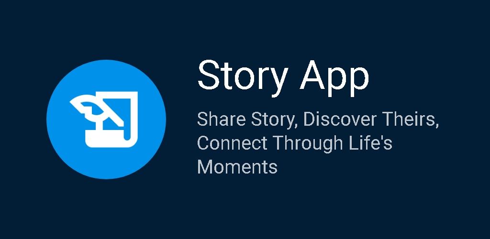


**Story App** is an Android application developed for **educational purposes only**. It allows users
to create an account, log in, post stories with pictures from their gallery or camera, add
locations, share activities, and explore other people's stories. The app is designed for learning
and no commercial use.

## Features 🌟

- **Create Account**: Sign up and join the app community.
- **Login**: Securely log in to your account.
- **Post a Story**: Share your stories with a title, description, and pictures from the gallery or
  camera.
- **Share Location**: Add location to your posts so others can see you on the map.
- **Browse Other Stories**: Discover and engage with stories posted by other users.

## Installation 🛠️

Follow these steps to install the app on your Android device or emulator:

1. **Clone the repository**:
   ```bash
   git clone https://github.com/waffiqaziz/story-app.git
   ```
2. Open in Android Studio: Open the project in Android Studio.
3. Sync Gradle Files: Android Studio will automatically sync the necessary Gradle files.
4. Setup your `MAPS_API_KEY`, follow this
   instruction [here](https://developers.google.com/maps/documentation/android-sdk/get-api-key).
   After you got the key put in `local.properties`
5. Run the App: Select a physical device or emulator, and click the "Run" button in Android Studio.

## Screenshots 📸

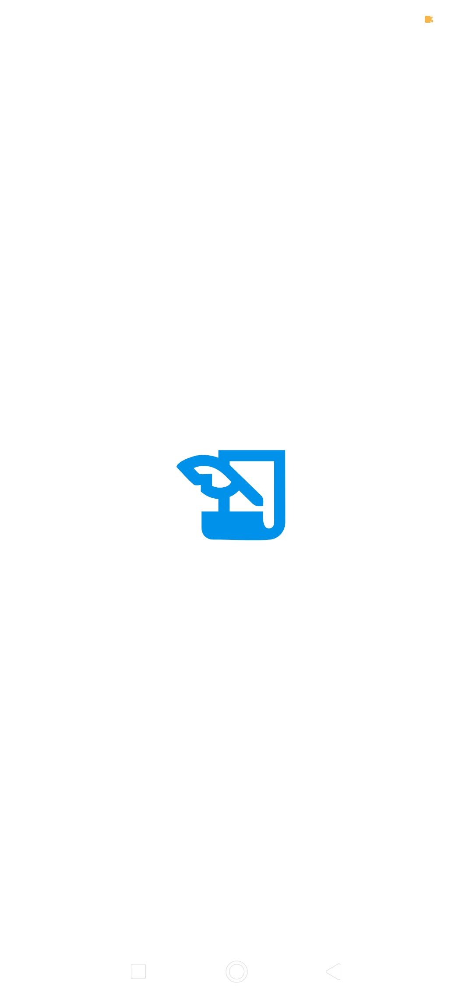&nbsp;
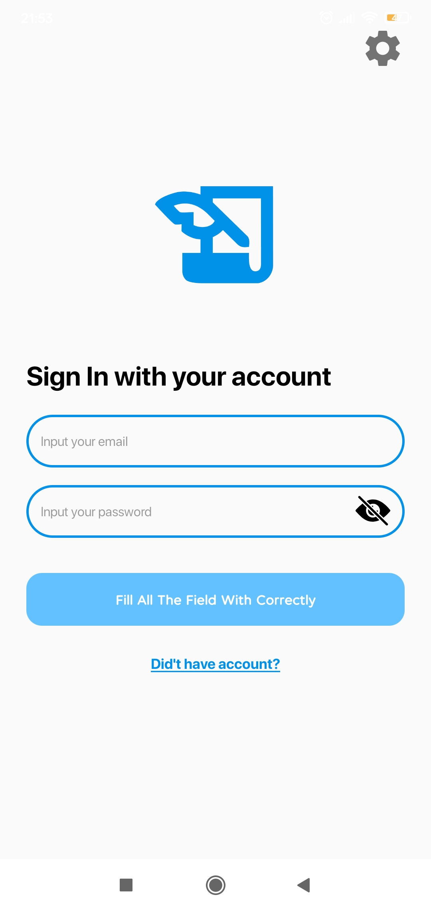&nbsp;
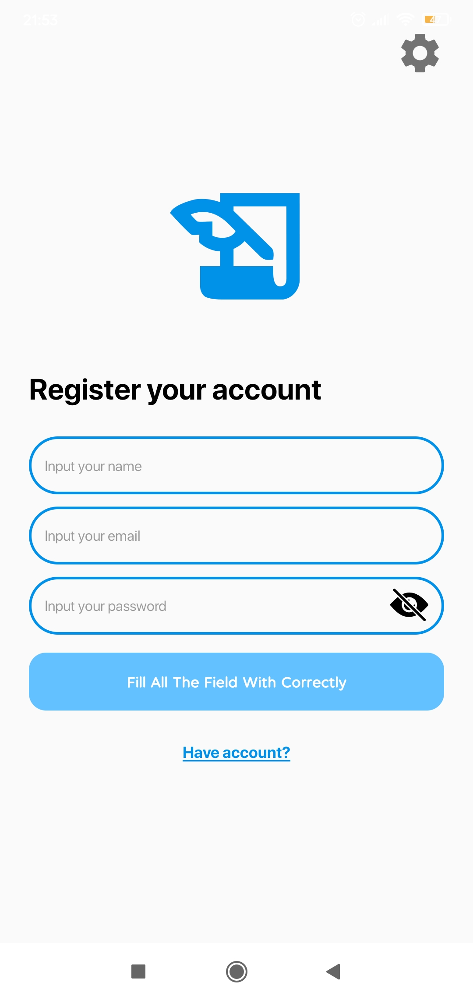&nbsp;
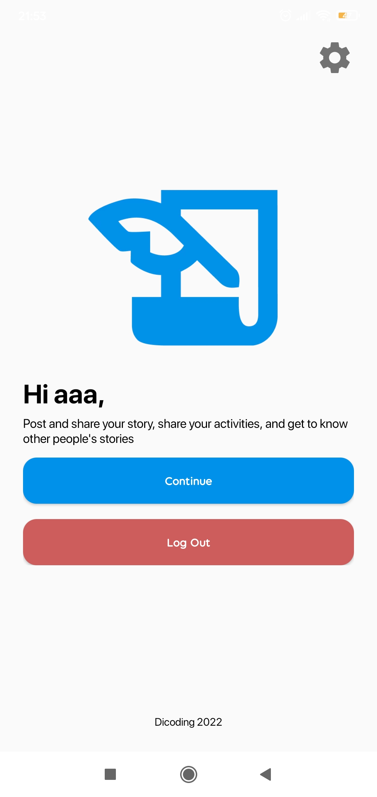&nbsp;
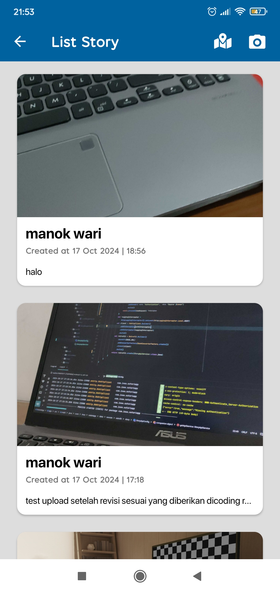&nbsp;
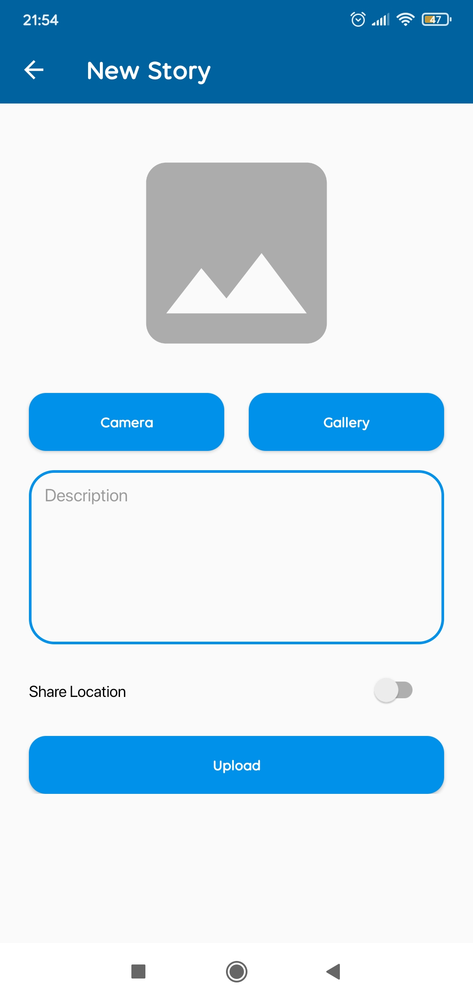&nbsp;
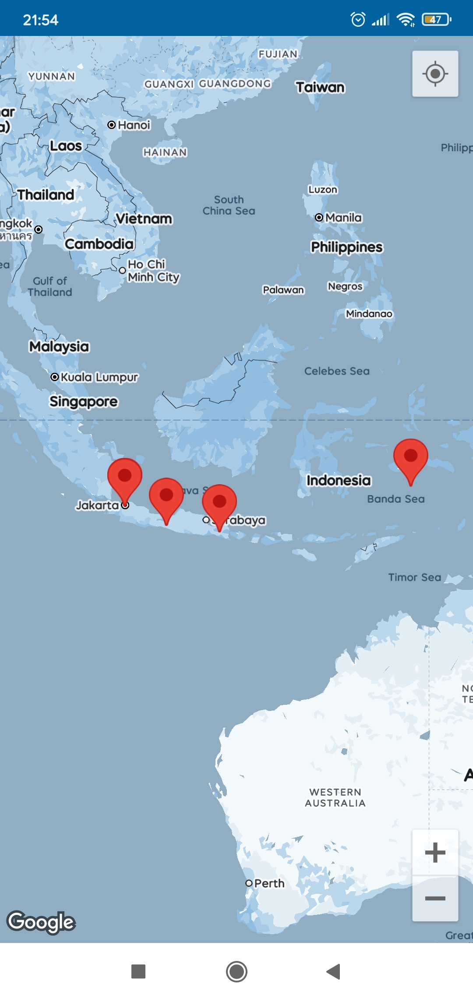&nbsp;

### Light Mode

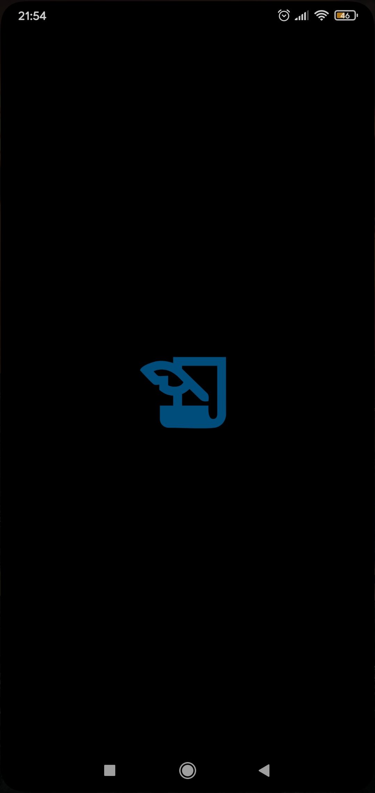&nbsp;
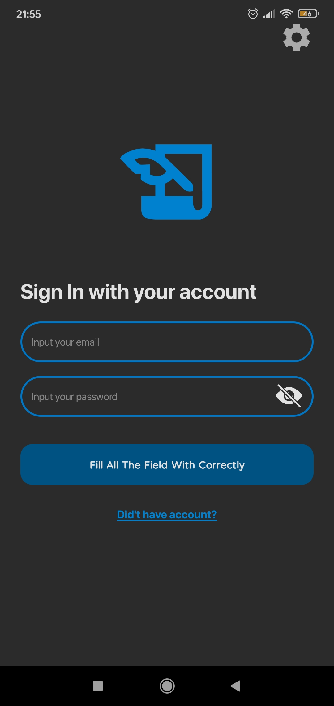&nbsp;
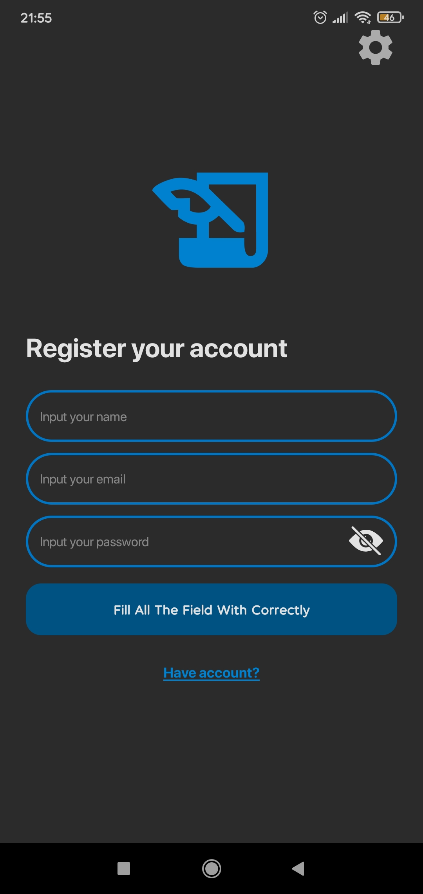&nbsp;
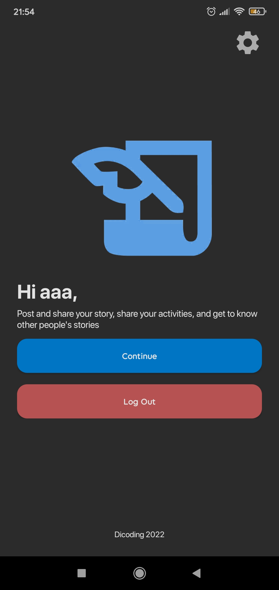&nbsp;
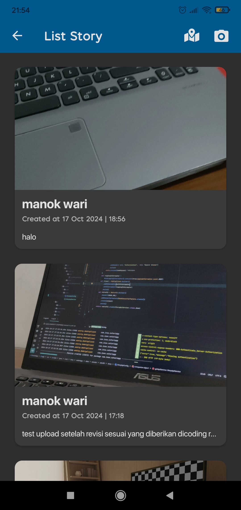&nbsp;
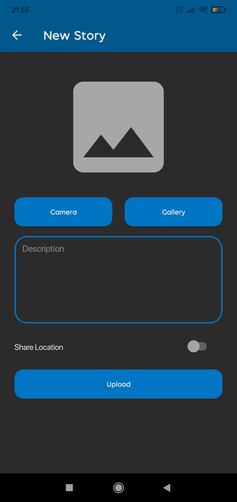&nbsp;
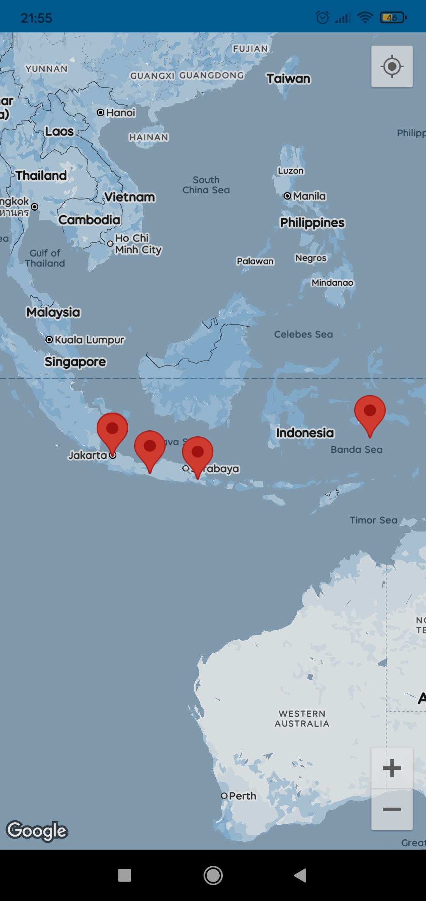&nbsp;

### Night Mode

## Technologies Used 🛠️

- Platform: Android (Kotlin)
- UI Framework: Android XML for layout designs
- Database: Room database (Paging3 with RemoteMeditor)
- Location Services: Google Maps API (for location sharing)
- Networking : Retrofit
- Testing: Junit, mockito, espresso

## Terms of Use 📜

Educational Use Only
This app is built solely for educational purposes, and by using it, users agree to the following
terms:

1. Non-commercial Use: Story App is not to be used for any commercial activities.
2. Third-party API Use: The third-party API used in this app is provided from an external source (
   bootcamp), and users should acknowledge that it is for learning purposes only.
3. User Content: Users are responsible for the stories they post. No inappropriate, offensive, or
   illegal content is allowed.
4. Privacy: Users should avoid sharing any personal, sensitive, or private information within the
   app.
5. Non-liability: The app developer is not liable for any misuse of the API or user-generated
   content shared through the app.

## Contributing 🤝

Contributions to the Story App are welcome! Follow these steps if you’d like to contribute:

1. Fork the repository.
2. Create a new branch `git checkout -b improve/new-improve`
3. Commit your changes `git commit -m 'Add new improve'`
4. Push the branch `git push origin improve/new-improve`
5. Open a pull request.